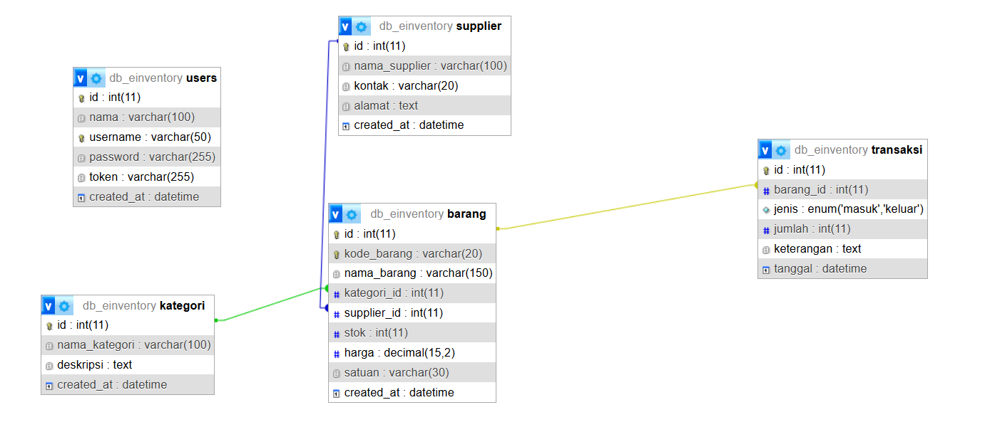
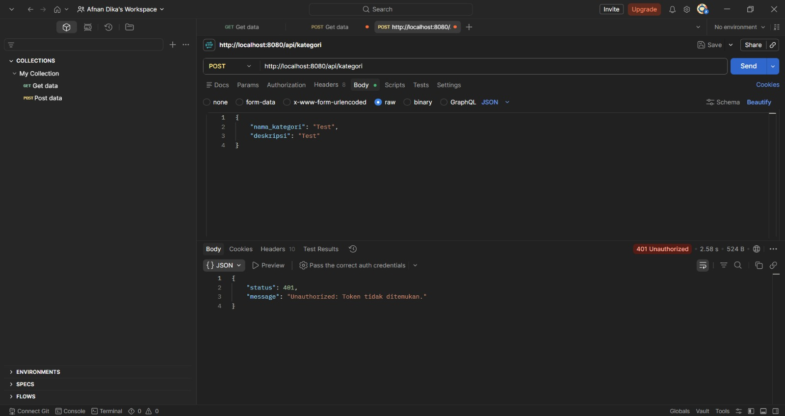
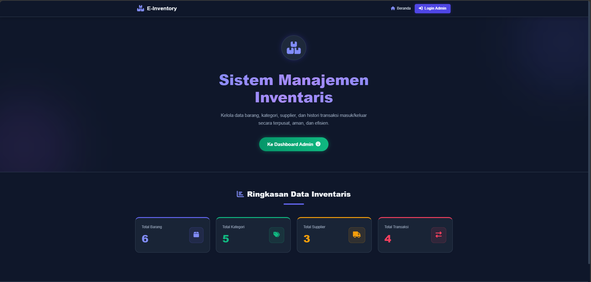
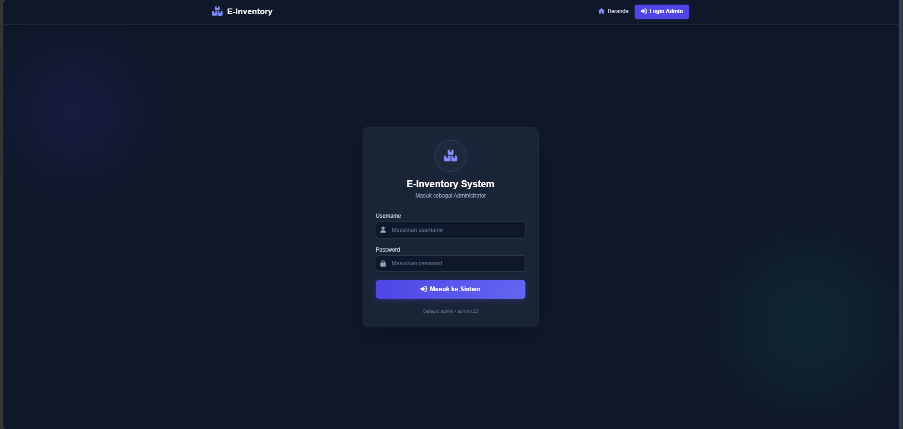
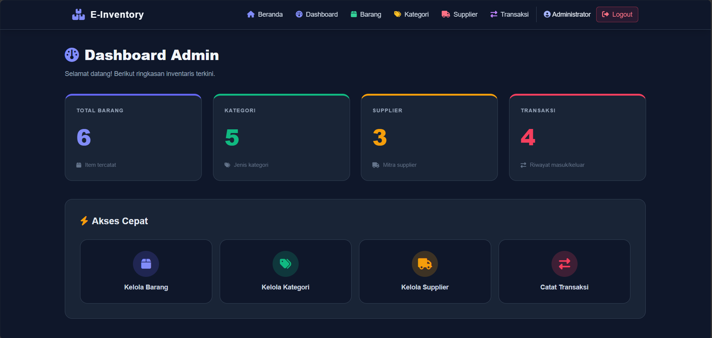
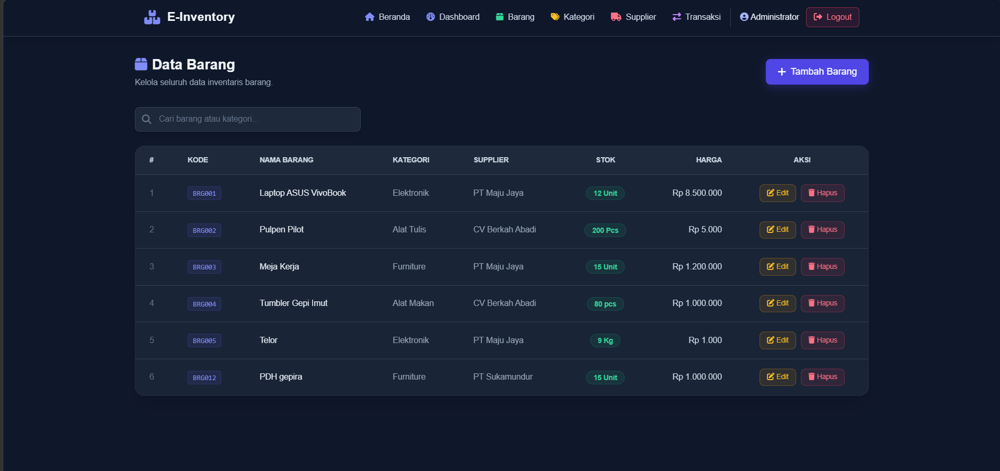
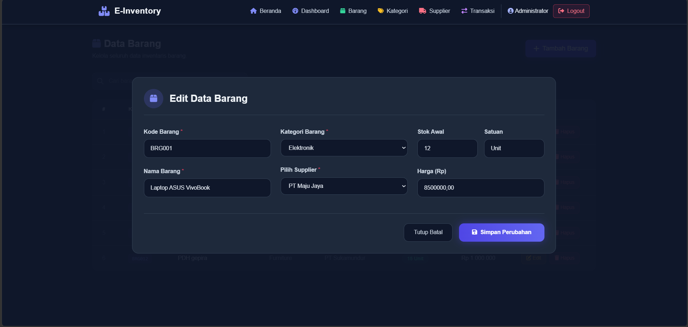
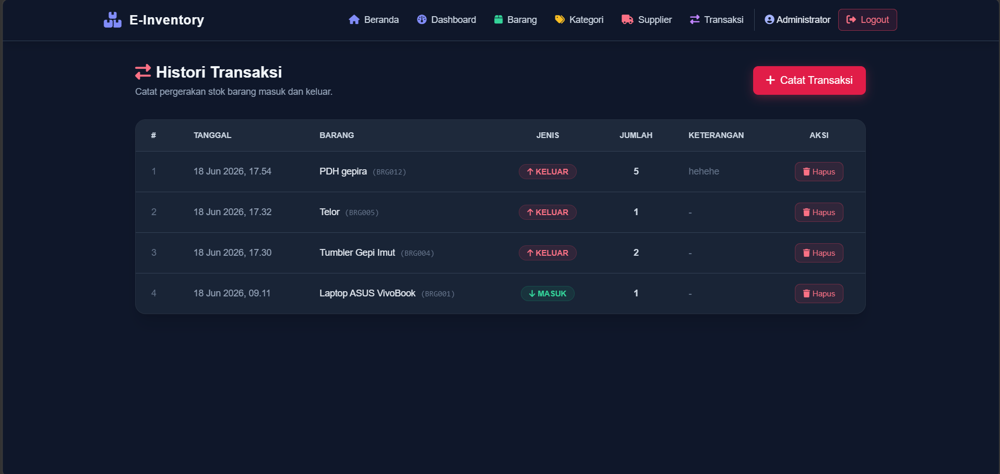

# 📦 E-Inventory System
### Sistem Manajemen Inventaris Barang

> **Tugas Akhir Semester (UAS) — Pemrograman Web 2**

| Info | Detail |
|------|--------|
| **Nama** | Afnan Dika Ramadhan |
| **NIM** | 312410518 |
| **Kelas** | TI-241E |
| **Tema** | Sistem Manajemen Inventaris Barang (E-Inventory) |

---

## 📋 Deskripsi Proyek

**E-Inventory System** adalah aplikasi web berbasis **Decoupled Architecture** (arsitektur terpisah antara Backend dan Frontend) untuk mengelola data inventaris barang secara terpusat dan efisien.

Aplikasi ini memungkinkan administrator untuk:
- Mengelola **data barang** beserta stok dan harga
- Mengelola **kategori barang** untuk pengelompokan
- Mengelola **data supplier** / pemasok barang
- Mencatat **histori transaksi** barang masuk dan keluar secara otomatis
- Melihat **ringkasan statistik** inventaris secara real-time

---

## 🛠️ Teknologi yang Digunakan

| Komponen | Teknologi |
|----------|-----------|
| **Backend** | PHP — CodeIgniter 4 (RESTful API) |
| **Frontend** | VueJS 3 (SPA via CDN) + Vue Router |
| **UI Framework** | TailwindCSS via CDN |
| **HTTP Client** | Axios |
| **Database** | MySQL / MariaDB |
| **Server** | XAMPP (Apache + MySQL) |

---

## 🗄️ Skema Relasi Database

> 📸 **Screenshot skema relasi tabel dari phpMyAdmin Designer:**

<!-- Ganti dengan screenshot relasi tabel dari phpMyAdmin kamu -->


**Penjelasan Relasi Tabel:**
- Tabel `barang` berelasi **Many-to-One** dengan tabel `kategori` (via `kategori_id`)
- Tabel `barang` berelasi **Many-to-One** dengan tabel `supplier` (via `supplier_id`)
- Tabel `transaksi` berelasi **Many-to-One** dengan tabel `barang` (via `barang_id`)
- Tabel `users` berdiri sendiri sebagai tabel autentikasi administrator

---

## 🔐 Uji Coba Proteksi Token (Error 401)

> 📸 **Screenshot uji coba via Postman — request tanpa token ditolak dengan response 401 Unauthorized:**

<!-- Ganti dengan screenshot Postman kamu -->


Endpoint manipulasi data **(POST, PUT, DELETE)** diproteksi menggunakan **CodeIgniter Filter** dengan mekanisme **Authorization Bearer Token**. Request tanpa token atau token tidak valid akan langsung ditolak oleh server dengan response `401 Unauthorized`.

---

## 🖥️ Screenshot Antarmuka Aplikasi

### Halaman Beranda (Public)
<!-- Ganti dengan screenshot halaman beranda kamu -->


### Halaman Login
<!-- Ganti dengan screenshot halaman login kamu -->


### Dashboard Admin
<!-- Ganti dengan screenshot dashboard kamu -->


### Halaman Data Barang (Tabel TailwindCSS)
<!-- Ganti dengan screenshot tabel barang kamu -->


### Form Modal Tambah / Edit Data
<!-- Ganti dengan screenshot modal form kamu -->


### Halaman Histori Transaksi
<!-- Ganti dengan screenshot transaksi kamu -->


---

## ⚙️ Petunjuk Instalasi & Menjalankan Proyek

### Prasyarat
Pastikan sudah terinstall:
- [XAMPP](https://www.apachefriends.org/) (PHP 8.1+, MySQL)
- [Composer](https://getcomposer.org/)
- Browser modern (Chrome / Firefox / Edge)

---

### 🔧 Menjalankan Backend (CodeIgniter 4)

**1. Clone repositori ini**
```bash
git clone https://github.com/username/UAS_Web2_312410518_AfnanDikaRamadhan.git
cd UAS_Web2_312410518_AfnanDikaRamadhan
```

**2. Masuk ke folder backend dan install dependency**
```bash
cd backend-api
composer install
```

**3. Konfigurasi environment**
```bash
# Copy file env menjadi .env
cp env .env
```

Buka file `.env` dan sesuaikan konfigurasi database:
```env
CI_ENVIRONMENT = development

database.default.hostname = localhost
database.default.database = db_einventory
database.default.username = root
database.default.password = 
database.default.DBDriver = MySQLi
database.default.port     = 3306
```

**4. Import database**
- Buka phpMyAdmin → `http://localhost/phpmyadmin`
- Buat database baru dengan nama: `db_einventory`
- Klik tab **Import** → pilih file `database.sql` di root repositori → klik **Go**

**5. Jalankan server CI4**
```bash
php spark serve --port=8080
```
Backend berjalan di: `http://localhost:8080`

---

### 🌐 Menjalankan Frontend (VueJS SPA)

**1. Masuk ke folder frontend**
```bash
cd frontend-spa
```

**2. Buka langsung di browser**
- Double klik file `index.html`, **ATAU**
- Gunakan ekstensi **Live Server** di VS Code → klik kanan `index.html` → *Open with Live Server*

Frontend berjalan di: `http://127.0.0.1:5500` atau `file:///path/frontend-spa/index.html`

---

### 🔑 Akun Default Administrator

| Username | Password |
|----------|----------|
| `admin` | `admin123` |

---

## 🌍 Link Demo & Presentasi

| | Link |
|--|------|
| 🎥 **Video Presentasi YouTube** | [Klik di sini](#) |
| 🌐 **Link Demo Aplikasi** | [Klik di sini](#) |

> ⚠️ *Ganti tanda `#` di atas dengan link YouTube dan link demo yang sebenarnya setelah diunggah.*

---

## 📁 Struktur Folder Repositori

```
UAS_Web2_312410518_AfnanDikaRamadhan/
│
├── backend-api/                  # CodeIgniter 4 — RESTful API Server
│   ├── app/
│   │   ├── Config/
│   │   │   ├── Filters.php       # Konfigurasi CORS & Auth Filter
│   │   │   └── Routes.php        # Definisi API Routes
│   │   ├── Controllers/
│   │   │   ├── AuthController.php
│   │   │   ├── BarangController.php
│   │   │   ├── KategoriController.php
│   │   │   ├── SupplierController.php
│   │   │   └── TransaksiController.php
│   │   ├── Filters/
│   │   │   ├── AuthFilter.php    # Bearer Token Validator
│   │   │   └── CorsFilter.php    # CORS Handler
│   │   └── Models/
│   │       ├── UserModel.php
│   │       ├── BarangModel.php
│   │       ├── KategoriModel.php
│   │       ├── SupplierModel.php
│   │       └── TransaksiModel.php
│   ├── .env                      # Konfigurasi environment (tidak di-commit)
│   └── database.sql              # File SQL skema & data awal
│
├── frontend-spa/                 # VueJS 3 SPA — Antarmuka Pengguna
│   ├── index.html                # Entry point utama aplikasi
│   └── components/
│       ├── App.js                # Root app, router, axios interceptor
│       ├── Navbar.js             # Komponen navigasi
│       ├── Home.js               # Halaman beranda (public)
│       ├── Login.js              # Halaman login
│       ├── Dashboard.js          # Dashboard admin
│       ├── Barang.js             # CRUD data barang
│       ├── Kategori.js           # CRUD kategori
│       ├── Supplier.js           # CRUD supplier
│       └── Transaksi.js          # Histori transaksi masuk/keluar
│
├── screenshots/                  # Folder screenshot untuk README
└── README.md                     # Dokumentasi proyek ini
```

---

## 🔗 Daftar Endpoint API

| Method | Endpoint | Auth | Deskripsi |
|--------|----------|:----:|-----------|
| `POST` | `/api/login` | ❌ | Login administrator |
| `GET` | `/api/summary` | ❌ | Ringkasan statistik data |
| `GET` | `/api/kategori` | ❌ | Ambil semua kategori |
| `POST` | `/api/kategori` | ✅ | Tambah kategori baru |
| `PUT` | `/api/kategori/{id}` | ✅ | Update kategori |
| `DELETE` | `/api/kategori/{id}` | ✅ | Hapus kategori |
| `GET` | `/api/supplier` | ❌ | Ambil semua supplier |
| `POST` | `/api/supplier` | ✅ | Tambah supplier baru |
| `PUT` | `/api/supplier/{id}` | ✅ | Update supplier |
| `DELETE` | `/api/supplier/{id}` | ✅ | Hapus supplier |
| `GET` | `/api/barang` | ❌ | Ambil semua barang |
| `POST` | `/api/barang` | ✅ | Tambah barang baru |
| `PUT` | `/api/barang/{id}` | ✅ | Update barang |
| `DELETE` | `/api/barang/{id}` | ✅ | Hapus barang |
| `GET` | `/api/transaksi` | ❌ | Ambil histori transaksi |
| `POST` | `/api/transaksi` | ✅ | Catat transaksi baru |
| `DELETE` | `/api/transaksi/{id}` | ✅ | Hapus transaksi |

> ✅ = Memerlukan `Authorization: Bearer {token}` di header request

---

<p align="center">
  Dibuat dengan ❤️ oleh <strong>Afnan Dika Ramadhan</strong> — NIM 312410518 — Kelas TI-241E
</p>
